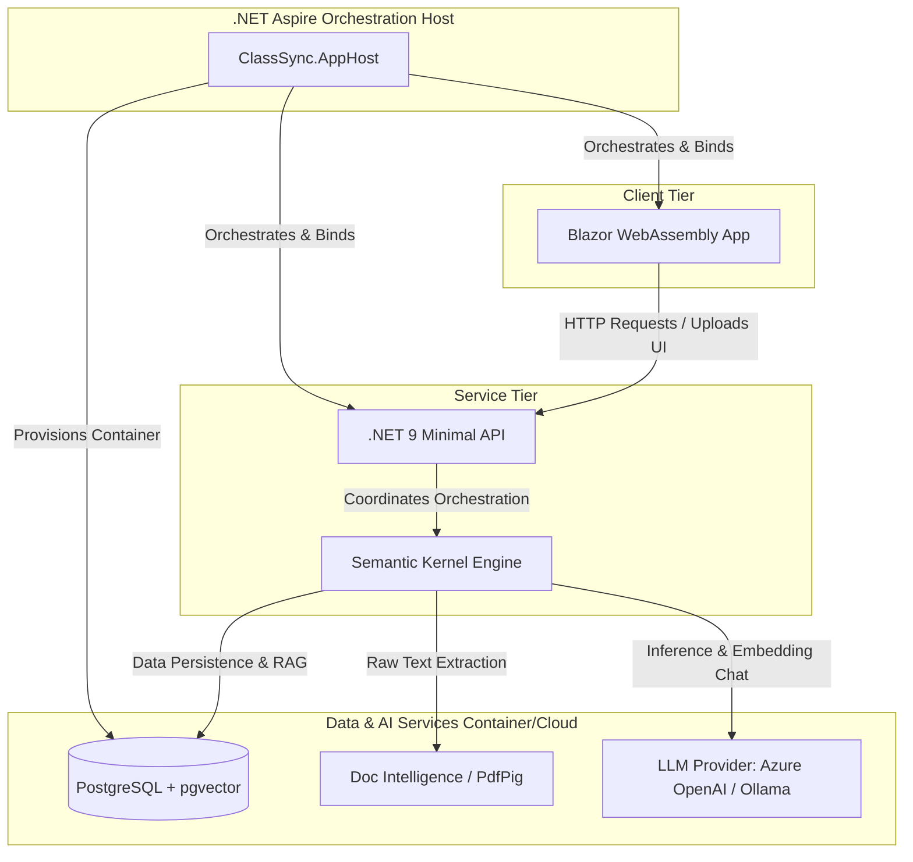

# ClassSync

An AI-powered academic platform that transforms lengthy, complex course syllabi into a centralized personal dashboard to simplify semester management for students.

## Core Capabilities

*   **Structured Schema Extraction:** Processes raw text from uploaded PDF or DOCX syllabi via Semantic Kernel to parse course metadata, assignments, exam dates, and grading weights into strict JSON matching a relational database schema.
*   **Deterministic Scheduling Engine:** Cross-references relative syllabus dates (e.g., "Week 3 Thursday") with an absolute course start date to programmatically determine calendar events, tracking them via a unified in-app calendar.
*   **Adaptive Task Management:** Generates granular reading plans based on provided lecture schedules, allowing students to track completion states and algorithmically rebalance reading milestones if deadlines are missed.
*   **Contextual Policy Q&A (RAG):** Utilizes PostgreSQL with the `pgvector` extension to chunk and embed syllabus contents, allowing students to run natural language queries against course-specific rules, grading metrics, and prerequisites.

## System Architecture

Managed via **.NET Aspire**, the solution coordinates a containerized **PostgreSQL** database, a high-performance **.NET Minimal API** backend handling the AI orchestration pipeline, and a decoupled **Blazor** single-page application frontend.

---

### Mermaid Code Block To Insert Manually



| Layer | Component | Technical Role |
| :--- | :--- | :--- |
| **Orchestration** | **.NET Aspire** | Manages local containers (DB, Ollama) and wires up connection strings/telemetry seamlessly. |
| **Frontend** | **Blazor WebAssembly** | SPA compiled to WebAssembly. Uses MudBlazor for calendars and layout review screens. |
| **Backend API** | **.NET 9 Minimal APIs** | Exposes high-performance endpoints. Coordinates PDF uploading, extraction, and token-handling. |
| **AI Orchestration**| **Semantic Kernel** | Manages prompt execution contexts, structural JSON parsing, and vector store operations. |
| **Database** | **PostgreSQL + pgvector** | Stores structural user data, parsed calendar intervals, and chunked embedding segments. |
| **Document Parsing**| **PdfPig (OSS) / Azure AI Doc Intel** | Extracts layout-aware raw text from incoming 30-page PDF files. |
| **LLM Inference** | **Azure OpenAI (or Local Ollama)** | Powers the data extraction models (`gpt-4o-mini`) and text embedding generation models. |

## Prerequisites

Ensure you have the following installed on your local workstation:

*   [.NET 9.0 SDK](https://dotnet.microsoft.com/download/dotnet/9.0) or later
*   [Docker Desktop](https://www.docker.com/products/docker-desktop/) or Podman (Required by .NET Aspire to run container dependencies)
*   [VS Code](https://code.visualstudio.com/) with the C# Dev Kit extension

Install the .NET Aspire workload:

```bash
dotnet workload install aspire
```

## Getting Started

### 1. Run the Application

Ensure your local container runtime (Docker or Podman) is running, then navigate to the root directory of the workspace and start the orchestration host:

```bash
dotnet run --project ClassSync.AppHost/
```

### 2. Access the Dashboards

Once the startup sequence completes, open the relevant dashboard for the task at hand:

*   **Aspire Dashboard:** Use the local URL printed in the terminal (typically http://localhost:17005) to inspect AppHost resources, PostgreSQL container startup, service logs, and OpenTelemetry traces for API requests and LLM orchestration cycles.

*   **Student Dashboard:** Open the Blazor web UI at http://localhost:5286 (or https://localhost:7087 when running the HTTPS profile) to use the student-facing ClassSync experience.
